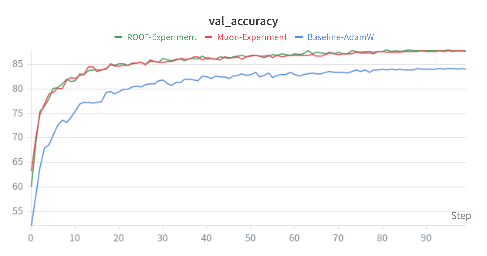
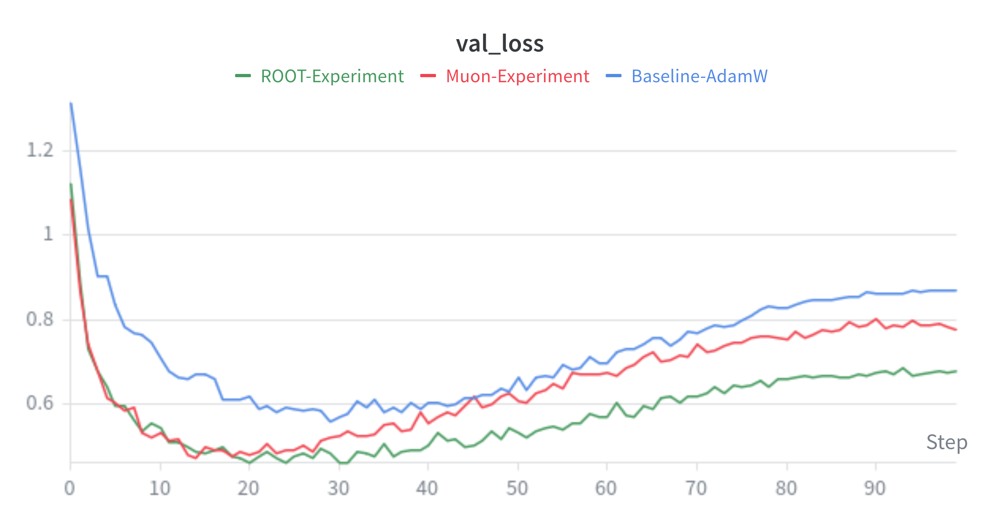

# Robust Orthogonalization in Computer Vision: Muon vs. ROOT

## Project Overview
This repository contains my implementation for an optimization class project: a reproducibility study evaluating the **Muon** and **ROOT** optimizers against an **AdamW** baseline. My specific focus for this project was the Computer Vision domain, evaluating these optimizers on a **ResNet-18** architecture trained from scratch on the **CIFAR-10** dataset.

## Project Report
For a deep dive into our full methodology, mathematical proofs, and comprehensive results across multiple domains, you can read our complete write-up here:
**[Report (PDF)](assets/Final_Report.pdf)**

## Key Findings
Our experiments demonstrated that orthogonalization provides significant benefits for training convolutional networks:
* **Early Convergence Acceleration:** Both orthogonalizers provided massive early-stage acceleration. At 10 epochs, AdamW hit only 74.52% validation accuracy, while Muon and ROOT exceeded 82%.
* **Superior Final Precision:** ROOT achieved the highest overall validation accuracy (**88.00%**) and the lowest validation loss (**0.67723**) over 100 epochs, demonstrating its ability to suppress gradient noise and reduce overfitting.
* **Negligible Overhead:** ROOT achieved these gains with only ~1.5% extra wall-clock time compared to Muon.

## Visuals
*(Note: Replace the links below with the actual paths to your saved wandb chart images)*



## How to Run
If you would like to run these experiments locally, first install the required dependencies:

```bash
pip install -r requirements.txt
```

Then, you can execute any of the three training scripts from your terminal:

```bash
# Run the AdamW Baseline
python baseline_train.py

# Run the Muon Optimizer experiment
python muon.py

# Run the ROOT Optimizer experiment
python root.py
```

## Team Acknowledgments
This was a collaborative reproducibility study. 
* **Dev Rawal:** Led the Computer Vision domain (CIFAR-10, ResNet-18) and authored the code in this repository.
* **Ahmad Alhassan:** Managed the Language Modeling domain (NanoGPT). 

For complete context, methodology, and results across both domains, please refer to the attached `Final_Report.pdf` included in this repository.
